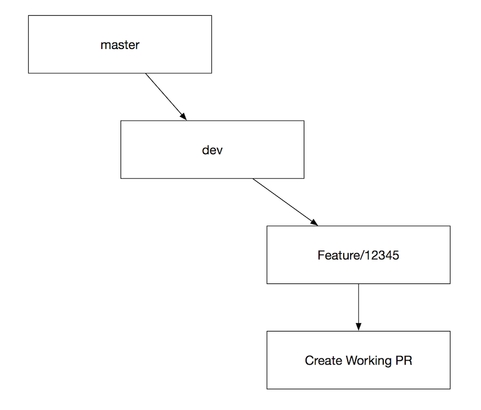
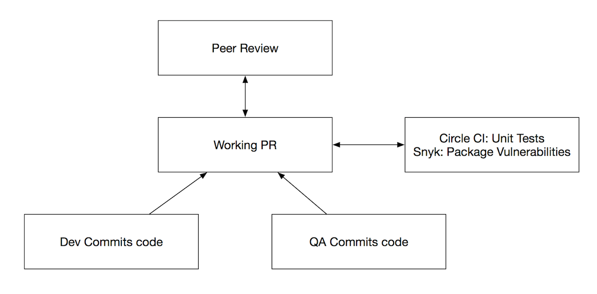
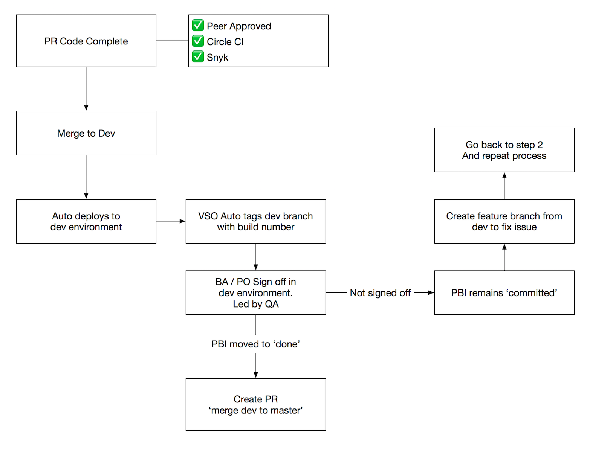

# Proposed Workflow Changes

As per recent discussion, here is an outline of the proposed changes...

## Developer starts work on feature/bug

## Work in progress for dev & QA

## Dev & QA work complete

## Promotion to master & UAT

