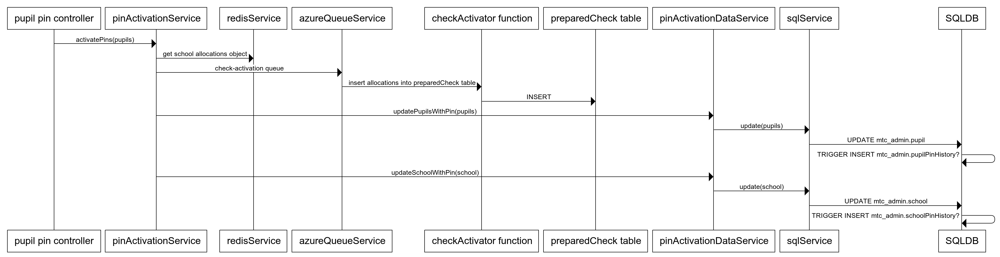

# Pin Activation

Once the pins are generated overnight, they can be activated the next day by a teacher.

## Process

### Summary
  - admin app gets pins from redis
  - updates pupil(s) and school record with pins
    - (optional/TBC) this then triggers an insert to the pin history tables
  - puts message on check-activation queue
    - check-activator inserts entries into preparedCheck table
  - pins are rendered on screen

