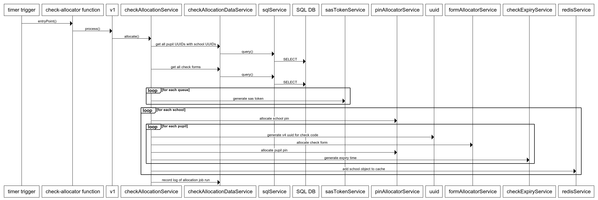

# overnight pin generation

## function apps
- update tsconfig.json, add tslint, add jasmine
- how do we share ts files across multiple function libraries to avoid duplication

## check allocation
- allocate pins and check form for entire pupil dataset (700k-1mil) every night.
- in a restart situation, we must allow a single update to reallocate the check form.
- no point in regenerating the pin unless business case is presented

### table storage
- delete and recreate table unsuitable due to deletion returning early and still running.  blocking name from being reused
- could be time consuming to purge.
  - Prove this with batch delete (TODO)
  - max 100 ops per batch 😱
  - batch must operate within one partition

### redis
- use TTL on allocations, no delete required 🎖
- takes ~25 minutes to generate 1.25 million check allocations.  the poc procedure uses a pre-fetched static check
- must include rebuild option for complete recovery when data lost (just run again via portal?)

