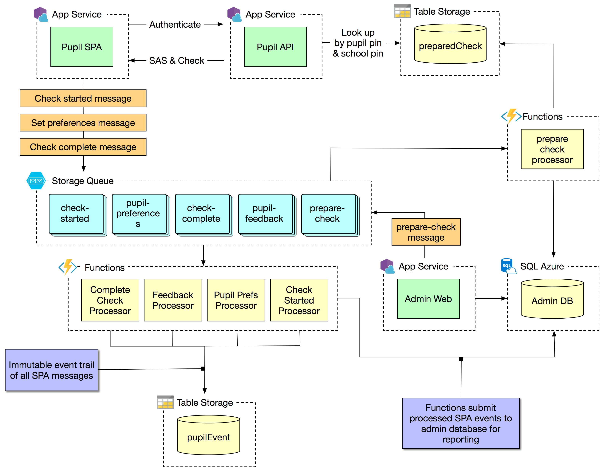

# Base queue and table names for Azure Storage

## Overview Diagram

## Queues

### check-started

submitted by SPA when pupil commences check

### check-complete

submitted by SPA when check is completed by pupil

### prepare-check

submitted by admin application when pins generated.

### pupil-feedback

submitted by SPA when pupil completes feedback form

### pupil-prefs

submitted by SPA when pupil modifies their access arrangements

## Tables

### preparedCheck

row created by prepareCheck function ready for lookup by Pupil API when pupil attempts authentication in SPA

### pupilEvent

stores raw messages submitted to queues from SPA.  row created by corresponding queue listener function `(check-started, pupil-feedback, check-complete, pupil-prefs)`.  Additional processing will happen within these functions to update admin database with check results etc.
