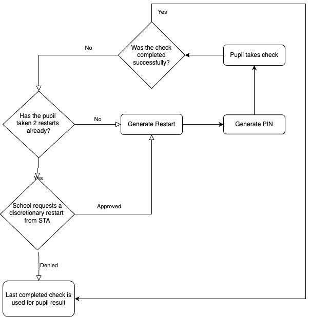

# Restarts

## Overview

If a Pupils Live Check is interrupted or spoiled in some way, they have the opportunity to resit the check.  Each pupil has 2 restarts available, allowing for 3 live checks in total.  The restart is created by the teacher or headteacher associated with the same school as the pupil.  The previous/spoiled check will not be included in the results, and the Pupil can have a new pin generated immediately.

## Discretionary Restarts

If a pupil has used all of their restarts, the school can request a discretionary restart from STA.  The service manager can approve this request via the Admin app.

