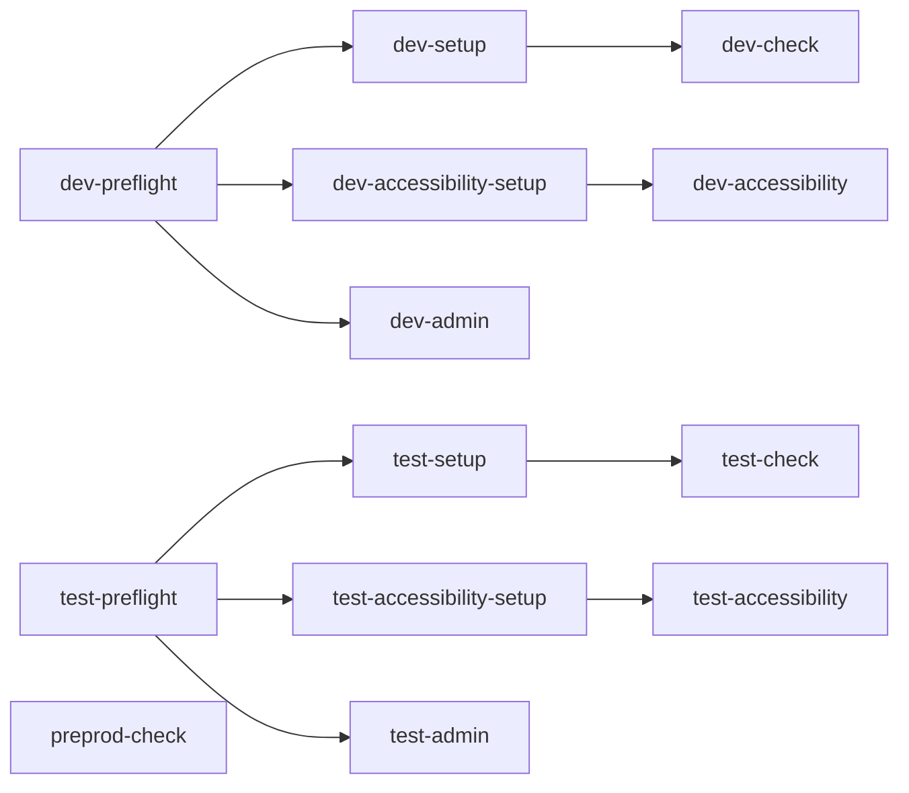

# Playwright Developer Guide

This guide explains how the Playwright framework in this repo is structured, how tests execute locally and in Azure Pipelines, and how to safely extend it.

Companion docs:

- Quick start and command catalog: `test/PlaywrightTestREADME.md`
- Failures and fixes: `test/pupil-hpa/TROUBLESHOOTING.md`
- Teams notification details: `test/pupil-hpa/TEAMS_INTEGRATION.md`

## Documentation index (important testing framework docs)

- `test/PlaywrightTestREADME.md`: Main reference for setup, run commands, environments, pipeline usage, release/change process, and reporting.
- `test/pupil-hpa/DEVELOPER_GUIDE.md`: Framework architecture, project dependency model, CI flow, and onboarding checklist.
- `azure-pipelines.yml`: Source of truth for pipeline jobs, schedules, environment variables, test execution, result publishing, and Teams summary notification.
- `AZURE_PIPELINE_VERIFICATION_CHECKLIST.md`: Practical runbook to verify pipeline wiring, validate test execution in Azure DevOps, and check production readiness.
- `test/pupil-hpa/TROUBLESHOOTING.md`: Common Playwright and pipeline failures with likely causes and step-by-step fixes (including preprod auth refresh).
- `test/pupil-hpa/TEAMS_INTEGRATION.md`: Configuration and operation of Teams notifications, including webhook setup and troubleshooting.
- `test/pupil-hpa/playwright.config.ts`: Test project definitions, environment mappings, setup dependencies, retries, reporters, and evidence capture settings.


## 1. What lives where

- Test package root: `test/pupil-hpa`
- Playwright config and project graph: `test/pupil-hpa/playwright.config.ts`
- npm run scripts used locally and in CI: `test/pupil-hpa/package.json`
- Azure pipeline definition: `azure-pipelines.yml`
- Preprod storage state source (repo root): `auth.json`

## 2. Framework model

This suite is project-driven. Each Playwright project represents an environment and purpose:

- Preflight projects normalize environment state.
- Setup projects create/prepare pupil data.
- Check projects run pupil journey tests.
- Admin projects run admin-only specs.
- Accessibility projects run accessibility-specific flow and setup.
- Preprod uses storage state and does not use setup dependencies.

Core config behavior from `playwright.config.ts`:

- `workers: 1` and `fullyParallel: false` to reduce state contention.
- `retries: 2` in CI, `0` locally.
- Evidence on failure/retry:
  - trace on first retry
  - screenshot on failure
  - video retained on failure
- Reporters:
  - CI: line + html
  - local: list + html
  - optional Teams reporter when `TEAMS_WEBHOOK_URL` is set and notifications are not disabled

## 3. Project dependency graph

Execution order is driven by Playwright project dependencies.



Important:

- `dev-admin` and `test-admin` depend on preflight only.
- `dev-check` and `test-check` depend on setup.
- `dev-accessibility` and `test-accessibility` depend on dedicated accessibility setup.
- `preprod-check` uses `../../auth.json` storage state and has no setup dependency.

## 4. How npm scripts run the suite

The high-level scripts are intentionally split into staged runs.

### Dev and test staged runs

`test:e2e:dev:run` and `test:e2e:test:run` each execute two stages:

1. accessibility project
2. main projects (`*-check` plus `*-admin`)

Each stage writes a separate blob file and JUnit name via env vars:

- `PLAYWRIGHT_BLOB_OUTPUT_FILE`
- `PLAYWRIGHT_JUNIT_OUTPUT_NAME`

Then wrapper scripts (`test:e2e:dev`, `test:e2e:test`) do:

1. report clean
2. staged run
3. merge reports into HTML
4. show HTML report only when not in CI

### Preprod run

`test:e2e:preprod:run` runs `preprod-check` specs with storage state from root `auth.json`.

### Reporting behavior in CI

CI sets `PW_E2E_ARGS='--reporter=blob,junit,line'` so that:

- blob outputs are available for merge/debug
- JUnit XML is available for Azure `PublishTestResults`
- line output is visible in logs

## 5. Azure pipeline job flow

Pipeline file: `azure-pipelines.yml`

Jobs:

- `Playwright - Dev`
- `Playwright - Test`
- `Playwright - Preprod`
- `Notify Teams - Pipeline Summary`

Each environment job does the same lifecycle:

1. Checkout code
2. Install Node 20
3. Restore npm cache
4. `npm ci` in `test/pupil-hpa`
5. `npx playwright install --with-deps`
6. Restore root `auth.json` from `AUTH_JSON_CONTENT` (base64 decode first, raw fallback)
7. Run environment script with CI env vars and reporter args
8. Publish JUnit test results
9. Publish test-results artifact
10. Publish HTML report artifact

Preprod scheduling rule:

- Preprod job is skipped for scheduled weekday runs.
- Preprod runs for non-scheduled runs (for example manual and CI on master).

## 6. Secrets and environment variables

Minimum required secrets/vars:

- `AUTH_JSON_CONTENT` for restoring root `auth.json`
- `ADMIN_USERNAME` and `ADMIN_PASSWORD` for dev/test admin login override (fallbacks exist in specs)
- `TEAMS_WEBHOOK_URL` for Teams notifications

Target URLs can be overridden with:

- `ADMIN_BASE_URL`
- `PUPIL_BASE_URL`
- `PUPIL_API_BASE_URL`

## 7. Local developer workflows

First-time setup:

```bash
cd test/pupil-hpa
npm ci
npx playwright install --with-deps
```

Useful runs:

```bash
# Full package
npm test

# Environment check flow (auto setup dependency)
npx playwright test --project=test-check

# Admin-only
npx playwright test --project=test-admin

# Debug setup in headed mode
npx playwright test ensure-pupil.setup.playwright.ts --project=test-setup --headed

# API smoke subset
npm run test:api:ping
```

## 8. How to add or change tests safely

When adding a new spec:

1. Decide which project type it belongs to (`*-admin`, `*-check`, `*-accessibility`).
2. Update `testMatch` or `testIgnore` rules only if necessary.
3. Preserve existing dependency chain (preflight/setup/accessibility setup).
4. Run targeted project locally, then run environment e2e script.

When changing pipeline behavior:

1. Validate JUnit output still lands in `test/pupil-hpa/test-results/*.xml`.
2. Validate blob report merge still produces `playwright-report`.
3. Ensure scheduled vs non-scheduled preprod behavior remains intentional.

## 9. Debugging and operational tips

- For failures, start with `test/pupil-hpa/TROUBLESHOOTING.md`.
- Prefer single-project reruns with `--headed` for UI diagnosis.
- Check artifacts in this order:
  1. line logs in job output
  2. JUnit entries in Azure Tests tab
  3. Playwright HTML report
  4. trace/video/screenshot evidence under `test-results`

## 10. New-joiner first week checklist

1. Run one local smoke command from `test/pupil-hpa`.
2. Understand project dependencies from `playwright.config.ts`.
3. Read the pipeline jobs in `azure-pipelines.yml`.
4. Review troubleshooting runbook for preprod auth/session issues.
5. Pair on one failing test triage from artifact to root cause.