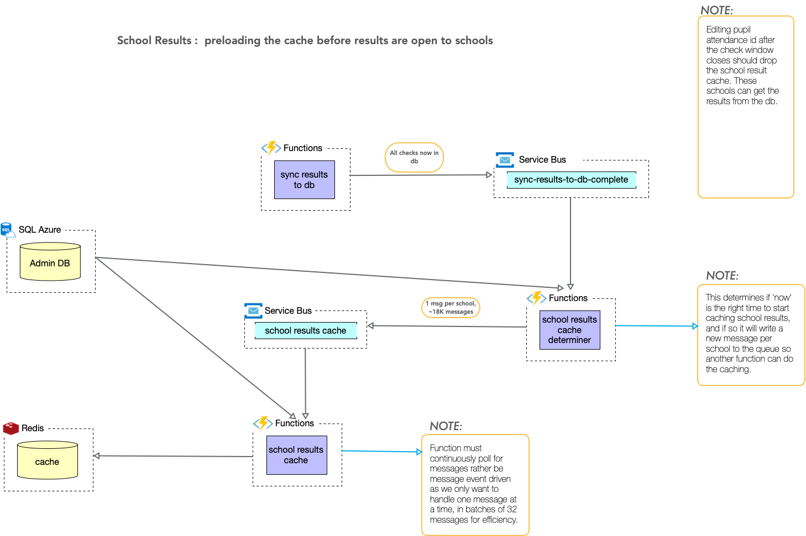

# Function: `school-results-cache-determiner`

## Triggered by
A message inserted onto the `sync-results-to-db-complete` queue which in turn is generated when the `sync-results-to-sql` function has completed it's nightly run.  For local development you should set the `sync-results-to-db` function to run more frequently.

## Output bindings
None OR approx 17K messages placed on the service bus queue `school-results-cache`

For the duration of the test and live check window periods there is not action to take as the checks are still being taken, but, if the date/time is after the close of the live check window, and before the opening of the results on the following Monday morning (6am) it will output 1 message per school for all schools.

The message is a request for that school's results to be cached in Redis to prevent high load on the SQL server on the Monday morning when schools log in to check their results.

It is fairly basic and does not check whether the school results are up to date or not, as this is designed to be a lightweight function.

## Cache concerns

Note that the results are not fixed until the school has signed the HDF.  At the point of the results opening it is likely that many schools may not yet have signed the HDF.  If they edit any pupil's "Reason for not taking the check' the cached value will be dropped - their is a single JSON document per school.

## Environment variables

This function can be overridden by the environment variable:
`SCHOOL_RESULTS_CACHE` which takes a value defined in [the config](./config.ts)

This can be set to never send output, send output only if in date, or to always send output.  The default is the production setting: to send output based on the date check.

## Diagram of the function in the component

